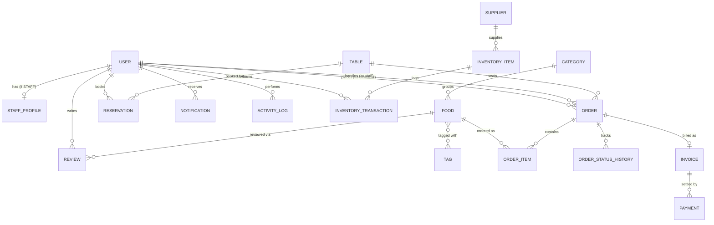

# FoodFusion — Database & Backend Architecture (Phase 2)

Status: **Draft for approval**. No Prisma schema, no APIs, no frontend until this is signed off. This document builds directly on the decisions locked in [`01-architecture-blueprint.md`](./01-architecture-blueprint.md) (3 roles, Kitchen as a Staff department, single restaurant, manual inventory, payment recorded not gateway-processed).

---

## Step 1 — Business Workflow Analysis

| Stage | What happens in the real world | Data **created** | Data **updated** | Data **deleted** |
|---|---|---|---|---|
| Customer arrives | Walk-in, or arrives for a reservation | — | If reservation exists: `Reservation.status → SEATED`, `Reservation.arrivedAt` set | — |
| Table reservation (optional) | Customer books ahead, by phone or self-service | `Reservation` row (customer/guest info, table, time, party size) | `Table.status → RESERVED` (only near the reservation time, not the moment it's booked) | — |
| Browse menu | Customer/staff views categories and items | — | — | — |
| Place order | Staff or customer submits an order | `Order` + one `OrderItem` per line + first `OrderStatusHistory` row | `Table.status → OCCUPIED` (if dine-in) | — |
| Kitchen preparation | Kitchen picks up the order | `OrderStatusHistory` row (CONFIRMED→PREPARING) | `Order.status → PREPARING` | — |
| Food ready | Kitchen finishes cooking | `OrderStatusHistory` row, `Notification` (alerts serving staff) | `Order.status → READY` | — |
| Served | Staff delivers food to the table/counter | `OrderStatusHistory` row | `Order.status → SERVED` | — |
| Payment | Bill settled | `Invoice` row (on first transition to payable), `Payment` row(s) | `Invoice.status → PAID`, `Order.status → COMPLETED`, `Table.status → AVAILABLE` | — |
| Order completed | Transaction closed | (later, optionally) `Review` | — | — |

Two things worth naming explicitly:
- **Nothing meaningful is ever hard-deleted** in this workflow. Cancellations, no-shows, and voided orders are *status transitions* (`CANCELLED`, `NO_SHOW`), not row deletions — a real restaurant needs to explain "what happened to table 4 at 8pm" months later, which a deleted row can't answer. This is why status enums and history tables matter more than delete permissions in this schema.
- **Reads dominate writes** at the "browse menu" stage and in reporting — this is why Category/Food are optimized for read access (public, cacheable) while Order/Payment are optimized for write integrity (transactional, historically frozen).

---

## Step 2 — Database Entities

| Entity | Purpose | Responsibilities | Future scalability |
|---|---|---|---|
| **User** | Single identity table for every human in the system (Admin, Staff, Customer) | Auth credentials, profile basics, role | Add OAuth providers, MFA fields later without touching other tables |
| **StaffProfile** | Staff-only attributes | Employee ID, department (FRONT_OF_HOUSE/KITCHEN), hire date, active status | Shift scheduling, hourly rate, performance metrics |
| **Category** | Groups menu items | Name, display order, active flag | Nested categories (parentId) if the menu grows complex |
| **Food** | A sellable menu item | Name, description, price, single `imageUrl`, availability, dietary flags | Multi-image gallery (promote to a `FoodImage` 1:N table when actually needed) |
| **Tag** | Reusable label (Vegan, Spicy, Chef's Special, Best Seller) | Name, color | Customer-facing filtering/search |
| **Table** | A physical dine-in table | Number, capacity, zone, status | Floor-plan coordinates (x/y) for a visual layout editor |
| **Reservation** | A booked table slot | Guest info (registered or walk-in phone booking), time, party size, status | Waitlist mode, deposit/prepayment |
| **Order** | Core transactional record | Type (dine-in/takeaway), links to table/customer/staff, computed totals | Delivery orders, third-party platform orders (extra `source` field, additive) |
| **OrderItem** | Line item within an order | Quantity, **snapshotted** name & price, notes | Modifiers/add-ons (extra cheese, no onion) as a child table later |
| **OrderStatusHistory** | Append-only trail of every status change on an order | From/to status, who changed it, when | Feeds kitchen throughput analytics directly |
| **Invoice** | Financial close-out document for an order | Subtotal, tax, discount, total, status | Multi-currency if needed later |
| **Payment** | One settlement attempt/transaction against an invoice | Amount, method, status, external transaction reference | Real gateway plugs in here without a schema change |
| **Supplier** | Vendor an inventory item is sourced from | Name, contact info | Purchase orders, lead times, pricing history |
| **InventoryItem** | A trackable stock item | Name, unit, current stock (cached), minimum threshold | Recipe/ingredient mapping to Food (deferred, see Phase 1 scope note) |
| **InventoryTransaction** | Append-only stock ledger | Type (in/out/adjustment/wastage), quantity, who, why | Full audit trail for accounting reconciliation |
| **Review** | Customer feedback | Rating, comment, moderation status | Staff replies, photo attachments |
| **Notification** | In-app message to a user | Type, message, read state | Push/email delivery channel later (additive column, not a schema change) |
| **ActivityLog** | Cross-cutting audit of sensitive actions | Actor, action, entity affected, metadata | Exportable compliance trail |
| **RestaurantSettings** | Singleton config | Name, address, tax rate, currency, hours | Becomes `Restaurant` (1 row → many rows) if multi-tenant ever happens |

**Deliberately excluded, with reasoning** (this is where I'm pushing back rather than rubber-stamping the requested list):

- **Roles/Permissions as tables** — not built. With exactly 3 fixed roles and fixed capabilities per role (defined in Phase 1), a full `Role`/`Permission`/`RolePermission` relational RBAC system is solving a problem you don't have: nobody is configuring custom roles at runtime. A `UserRole` enum plus middleware checks is simpler, faster, and just as correct. If a future requirement is "let the admin create custom roles with custom permissions," *that's* when this becomes a real table — building it now is speculative generality.
- **CustomerProfile as a separate table** — not built. Customers only need fields already on `User` (name, email, phone). A separate 1:1 table for zero extra fields is pure overhead. Revisit only when loyalty points/tiers are actually in scope (P2).
- **System/error logs as a database table** — explicitly recommended against, even though it was in the candidate list. Request logs, stack traces, and technical error logs are high-volume, have no relational value, and don't belong in your transactional Postgres instance — they belong in application-level logging (console/file in dev, a service like a log drain in production). `ActivityLog` is for *business* actions (who cancelled a reservation); it is not a place for exception stack traces.
- **Ingredients/recipe mapping** — deferred per Phase 1's manual-inventory decision. `InventoryItem` tracks stock generically; it isn't yet linked to which `Food` consumes how much of it.

---

## Step 3 — Database Relationships

| Relationship | Type | Why |
|---|---|---|
| User ↔ StaffProfile | One-to-One (optional) | Only exists for STAFF-role users; keeps staff-only fields off every other user |
| Category → Food | One-to-Many | A category groups many items; a food belongs to exactly one category |
| Food ↔ Tag | **Many-to-Many** | A food can be both "Vegan" and "Chef's Special"; a tag applies to many foods — this is the one legitimate M2M in v1, and it's genuinely needed (not forced) |
| Table → Reservation | One-to-Many | A table hosts many reservations over time; each reservation targets one table |
| Table → Order | One-to-Many | A table hosts many orders over its lifetime (nullable for takeaway orders) |
| User (customer) → Reservation | One-to-Many | A registered customer can have many reservations; reservations can also exist without a User (guest name/phone only) |
| User (customer) → Order | One-to-Many, nullable | Supports guest/staff-entered orders with no customer account |
| User (staff) → Order | One-to-Many | Tracks which staff member handled/created the order (accountability) |
| Order → OrderItem | One-to-Many | An order has multiple line items; each item belongs to one order |
| Food → OrderItem | One-to-Many | A food appears across many order items over time |
| Order → OrderStatusHistory | One-to-Many | Every status change on an order is its own row, in order |
| Order ↔ Invoice | One-to-One | Exactly one financial close-out document per order |
| Invoice → Payment | **One-to-Many** | An invoice can be settled by more than one payment record — partial payments, or a failed attempt followed by a successful one. This is the key design choice in Step 10, explained there. |
| Supplier → InventoryItem | One-to-Many | A supplier provides many stock items; each item has one primary supplier |
| InventoryItem → InventoryTransaction | One-to-Many | Every stock movement is its own ledger row |
| User → Review | One-to-Many | A customer can leave many reviews |
| Order/Food → Review | One-to-Many | A review is tied to the order (and optionally a specific food item) it's about |
| User → Notification | One-to-Many | A user accumulates many notifications |
| User → ActivityLog | One-to-Many | An actor performs many logged actions |

**On many-to-many, specifically**: Food↔Tag is the only one v1 genuinely needs. I deliberately did *not* force artificial M2M relationships elsewhere (e.g., Reservation↔Table staying 1:1 rather than supporting joined tables for large parties) — that's a real limitation, called out explicitly in the final review, not hidden. Adding a join table "just in case" is exactly the kind of unnecessary complexity this step warns against.

---

## Step 4 — Normalization

**1NF (atomic columns, no repeating groups)** — satisfied throughout: `Order` never stores a comma-separated list of food IDs; it has a proper `OrderItem` child table instead. `Food.tags` isn't a string column — it's the `Food↔Tag` join table.

**2NF (no partial dependency on part of a composite key)** — every table uses a single surrogate primary key (Step 5), so there are no composite keys to have partial dependencies on. Where a "composite-feeling" uniqueness exists (e.g., one invoice per order), it's enforced as a **unique constraint** on the foreign key (`Invoice.orderId @unique`), not as a composite primary key — this keeps the schema uniform.

**3NF (no transitive dependencies on non-key attributes)** — `Order` does not store `customerName` or `customerEmail` directly; it stores `customerId` and looks the name up via `User`. Same for `Food.categoryName` — it's not duplicated on `Food`, only `categoryId` is stored.

**The one deliberate, documented exception**: `OrderItem` stores a **snapshot** of `foodName` and `unitPrice` at the time of the order, even though that data technically already lives on `Food`. This looks like a 3NF violation but isn't a mistake — it's covered in depth in Step 8. Historical financial records must never change when today's menu changes; that's a correctness requirement, not a normalization oversight, and it's the standard pattern in every real order/billing system (e-commerce, POS, invoicing).

---

## Step 5 — Primary Keys

**Decision: `cuid()` for every model, applied consistently.**

| Option | Verdict |
|---|---|
| Auto-increment integer | Rejected — sequential IDs let anyone guess `/api/orders/1043` → `1044` and enumerate other customers' data; also awkward once/if multi-branch merging of databases is ever needed |
| UUID (v4) | Viable, but longer, and not naturally sortable by creation time |
| **CUID** | **Chosen** — collision-resistant, URL-safe, non-sequential (no enumeration risk), can be generated safely on the client if ever needed (e.g., optimistic UI), and Prisma's `@default(cuid())` makes this a zero-effort, consistent default across every model |

Consistency matters more than the specific choice here — every model uses the same ID strategy so there's never a "wait, is this table an int or a string id" bug at the join layer.

---

## Step 6 — Common Fields

| Field | Applied to | Reasoning |
|---|---|---|
| `id` | Every model | Universal |
| `createdAt` | Every model | Universal, needed for sorting/reporting everywhere |
| `updatedAt` | Every mutable model | Skipped on pure append-only logs (`OrderStatusHistory`, `ActivityLog`, `InventoryTransaction`, `Notification`) — those rows are never updated after creation, so the field would always just equal `createdAt` and add noise |
| `deletedAt` (soft delete) | `User`, `Food`, `Category`, `Table`, `InventoryItem`, `Supplier`, `Tag` | These are referenced by historical records (an old `OrderItem` still needs its `Food` to resolve, an old `Order` still needs its `Table`) — hard-deleting would break FKs or force `ON DELETE SET NULL` and lose meaning. Soft delete lets the record disappear from active UI while history stays intact. |
| *(no soft delete)* | `Order`, `OrderItem`, `Invoice`, `Payment`, `Reservation`, `Review`, logs | These are either already-historical-by-nature (never deleted, only status-transitioned) or genuinely disposable UI-only data (`Notification` rows can be hard-deleted once read/expired — no historical requirement) |
| `status` | `User` (active/inactive), `Order`, `Reservation`, `Invoice`, `Payment`, `Food` (availability) | Lifecycle-bearing entities |
| `createdBy` / `updatedBy` (as a `User` relation) | `Food`, `Category`, `InventoryItem` adjustments, `RestaurantSettings` changes | Accountability where "who changed this" matters for the business, not everywhere reflexively — a `Notification` doesn't need an `updatedBy`, it's system-generated |

---

## Step 7 — Enum Design

| Enum | Values |
|---|---|
| `UserRole` | `ADMIN`, `STAFF`, `CUSTOMER` |
| `StaffDepartment` | `FRONT_OF_HOUSE`, `KITCHEN` |
| `AccountStatus` | `ACTIVE`, `INACTIVE`, `SUSPENDED` |
| `TableStatus` | `AVAILABLE`, `RESERVED`, `OCCUPIED`, `UNAVAILABLE` |
| `ReservationStatus` | `PENDING`, `CONFIRMED`, `SEATED`, `COMPLETED`, `CANCELLED`, `NO_SHOW` |
| `OrderType` | `DINE_IN`, `TAKEAWAY` |
| `OrderStatus` | `PENDING`, `CONFIRMED`, `PREPARING`, `READY`, `SERVED`, `COMPLETED`, `CANCELLED` |
| `InvoiceStatus` | `UNPAID`, `PARTIALLY_PAID`, `PAID`, `REFUNDED` |
| `PaymentStatus` | `PENDING`, `SUCCESS`, `FAILED`, `REFUNDED` |
| `PaymentMethod` | `CASH`, `CARD`, `MOBILE_PAYMENT`, `BANK_TRANSFER` |
| `MeasurementUnit` | `KILOGRAM`, `GRAM`, `LITRE`, `MILLILITRE`, `PIECE` |
| `InventoryTransactionType` | `STOCK_IN`, `STOCK_OUT`, `ADJUSTMENT`, `WASTAGE` |
| `NotificationType` | `ORDER_UPDATE`, `RESERVATION_UPDATE`, `INVENTORY_ALERT`, `SYSTEM` |
| `ReviewStatus` | `PUBLISHED`, `HIDDEN` |

---

## Step 8 — Order System Design

```
Order
 ├─ subtotal        (sum of all OrderItem subtotals, stored)
 ├─ taxAmount        (computed at order time from RestaurantSettings.taxRate, stored)
 ├─ discountAmount     (stored)
 └─ totalAmount         (stored, = subtotal + tax - discount)

OrderItem (per line)
 ├─ foodId              (reference, for reporting joins)
 ├─ foodNameSnapshot      (copied from Food.name at order time)
 ├─ unitPriceSnapshot      (copied from Food.price at order time)
 ├─ quantity
 └─ subtotal                (= unitPriceSnapshot × quantity, stored)
```

**Why prices are never recalculated from the current menu**: if the Margherita Pizza was $12 in March and is $14 today, an order placed in March must still show $12 when anyone looks at it later — for reprinting a receipt, resolving a customer dispute, or generating March's revenue report. If `OrderItem` only stored `foodId` and looked up the live price, every historical order's total would silently change every time the menu price changed. That's not a hypothetical edge case — menu price changes are routine, and a billing system that can't reproduce a past receipt exactly is broken. Snapshotting is the standard, correct pattern (every e-commerce and POS system does this); it's the one place this schema intentionally trades normalization purity for correctness.

**OrderStatusHistory** exists alongside `Order.status` (not instead of it) because `Order.status` answers "what's the current state," while the history table answers "how long did each stage take" — which directly feeds the Reports module's kitchen-throughput and service-time analytics without any extra instrumentation later.

---

## Step 9 — Reservation System

```
Reservation
 ├─ customerId          (nullable — registered customer)
 ├─ guestName / guestPhone  (used when a walk-in calls in without an account — very common in real restaurants)
 ├─ tableId
 ├─ partySize
 ├─ reservationTime
 ├─ durationMinutes         (estimate, e.g. 90 — lays groundwork for double-booking prevention later)
 ├─ status                    (PENDING → CONFIRMED → SEATED → COMPLETED, or → CANCELLED / NO_SHOW)
 ├─ cancellationReason           (nullable, filled only if cancelled)
 ├─ arrivedAt                     (timestamp, set on SEATED)
 └─ completedAt                     (timestamp, set on COMPLETED)
```

Real-world details this captures: not every reservation comes from someone with an account (phone bookings need `guestName`/`guestPhone`), a restaurant needs to distinguish "cancelled in advance" from "just didn't show up" (`CANCELLED` vs `NO_SHOW` — these mean very different things for reporting and even for flagging repeat no-show customers later), and `arrivedAt`/`completedAt` let you later report on actual table turnover time versus the booked estimate.

---

## Step 10 — Payment Design

```
Order (1) ──── (1) Invoice ──── (1..N) Payment
```

**Invoice** is the *what's owed* document: `invoiceNumber`, `subtotal`, `taxAmount`, `discountAmount`, `totalAmount`, `status` (derived from its payments — `UNPAID` with none, `PARTIALLY_PAID` if payments sum to less than total, `PAID` once they cover it, `REFUNDED` if reversed).

**Payment** is *an attempt to settle it*: `amount`, `method`, `status`, `transactionReference` (nullable string — empty for cash, populated with a gateway transaction ID once one exists), `paidAt`, `notes`.

**Why one-to-many instead of one-to-one**: a single flat "Order has one payment" design breaks the moment any of these ordinary situations happens — a customer pays half in cash and half by card, a card attempt fails and is retried, or a real gateway is added later and its webhook needs to write a new record for each attempt without mutating history. Modeling `Payment` as a ledger against an `Invoice` means all of these are just "add another row" instead of schema changes. This is also exactly the seam Phase 1 flagged for future gateway integration: a real payment provider's webhook handler becomes a service that inserts a `Payment` row — it doesn't need to touch `Order` or `Invoice` structurally.

---

## Step 11 — Inventory Design

```
Supplier (1) ──── (N) InventoryItem (1) ──── (N) InventoryTransaction
```

**InventoryItem**: `name`, `unit` (`MeasurementUnit` enum), `currentStock` (decimal, **cached**), `minimumStock` (reorder threshold — used to flag "low stock" in the Overview dashboard), `supplierId`, `isActive`.

**InventoryTransaction**: `inventoryItemId`, `type` (`STOCK_IN` / `STOCK_OUT` / `ADJUSTMENT` / `WASTAGE`), `quantity`, `note`, `performedBy` (User), `createdAt`. This is an **append-only ledger** — stock is never edited directly; every change, in either direction, is its own row. This is the professional pattern for the same reason `OrderStatusHistory` exists: "why is the flour stock at 4kg" should always be answerable by reading the ledger, not by trusting a single mutable number.

`currentStock` on `InventoryItem` is a **cached, derived value** (the ledger is the actual source of truth) — kept in sync by writing it in the *same database transaction* as each new `InventoryTransaction` row. This is a deliberate performance tradeoff: summing the entire ledger every time the Overview dashboard needs to check "is anything low on stock" would get slower as the ledger grows; caching the running total avoids that while the ledger remains available for audits and recalculation if the cache ever needs to be rebuilt.

---

## Step 12 — Audit Logging Strategy

`ActivityLog` fields: `userId` (actor, nullable for system-initiated events), `action` (short code, e.g. `RESERVATION_CANCELLED`), `entityType`, `entityId`, `metadata` (JSON — flexible before/after context), `createdAt`.

**Logged**: login/logout, menu item created/edited/deleted, reservation cancelled, staff account created/deactivated, settings changed, payment marked paid/refunded, inventory manually adjusted.

**Not logged here** (handled elsewhere, deliberately not duplicated):
- Order status transitions → already fully captured by `OrderStatusHistory`, which is domain-specific and richer (from/to state). `ActivityLog` doesn't need a second, vaguer copy of the same event.
- Inventory stock movements → already fully captured by `InventoryTransaction`. Same reasoning.
- Any `GET`/read request → no business value, pure noise, would make the log unusable for actually auditing anything.

**Where logging happens**: at the **service layer**, right after a mutation succeeds — never in the controller (which shouldn't know what's "sensitive") and never as a database trigger (which would hide the logic from anyone reading the codebase). This keeps `ActivityLog` as the one place to answer "who changed X and when" for anything that doesn't already have its own dedicated history table, rather than a dumping ground for every event in the system.

---

## Step 13 — ER Diagram



---

## Step 14 — Prisma Model Planning (no schema code yet)

| Model | Purpose | Key Relationships | Expected Fields |
|---|---|---|---|
| `User` | Identity for all roles | 1:1 StaffProfile, 1:N Order/Reservation/Review/Notification/ActivityLog | id, name, email (unique), passwordHash, phone, role, accountStatus, avatarUrl, createdAt, updatedAt, deletedAt |
| `StaffProfile` | Staff-only attributes | 1:1 User | id, userId, employeeId, department, hiredAt, createdAt, updatedAt |
| `Category` | Menu grouping | 1:N Food | id, name, description, displayOrder, isActive, createdAt, updatedAt, deletedAt |
| `Food` | Menu item | N:1 Category, M:N Tag, 1:N OrderItem/Review | id, categoryId, name, description, price, imageUrl, isAvailable, isVegetarian, spiceLevel, createdBy, createdAt, updatedAt, deletedAt |
| `Tag` | Reusable label | M:N Food | id, name, colorHex, createdAt |
| `Table` | Physical table | 1:N Reservation/Order | id, number, capacity, zone, status, createdAt, updatedAt, deletedAt |
| `Reservation` | Booking | N:1 Table, N:1 User (nullable) | id, tableId, customerId, guestName, guestPhone, partySize, reservationTime, durationMinutes, status, cancellationReason, arrivedAt, completedAt, createdAt, updatedAt |
| `Order` | Transaction root | N:1 Table (nullable), N:1 User (customer, nullable), N:1 User (staff), 1:N OrderItem/OrderStatusHistory, 1:1 Invoice | id, orderNumber, type, tableId, customerId, staffId, status, subtotal, taxAmount, discountAmount, totalAmount, notes, createdAt, updatedAt |
| `OrderItem` | Order line item | N:1 Order, N:1 Food | id, orderId, foodId, foodNameSnapshot, unitPriceSnapshot, quantity, subtotal, specialInstructions |
| `OrderStatusHistory` | Status audit trail | N:1 Order, N:1 User (who changed it) | id, orderId, fromStatus, toStatus, changedById, note, createdAt |
| `Invoice` | Billing document | 1:1 Order, 1:N Payment | id, orderId, invoiceNumber, subtotal, taxAmount, discountAmount, totalAmount, status, issuedAt |
| `Payment` | Settlement record | N:1 Invoice | id, invoiceId, amount, method, status, transactionReference, paidAt, notes, createdAt |
| `Supplier` | Vendor | 1:N InventoryItem | id, name, contactPerson, phone, email, address, createdAt, updatedAt, deletedAt |
| `InventoryItem` | Stock item | N:1 Supplier, 1:N InventoryTransaction | id, name, unit, currentStock, minimumStock, supplierId, isActive, createdAt, updatedAt, deletedAt |
| `InventoryTransaction` | Stock ledger entry | N:1 InventoryItem, N:1 User | id, inventoryItemId, type, quantity, note, performedById, createdAt |
| `Review` | Customer feedback | N:1 User, N:1 Order, N:1 Food (nullable) | id, customerId, orderId, foodId, rating, comment, status, createdAt |
| `Notification` | In-app message | N:1 User | id, userId, type, message, isRead, createdAt |
| `ActivityLog` | Sensitive-action audit | N:1 User (nullable) | id, userId, action, entityType, entityId, metadata, createdAt |
| `RestaurantSettings` | Singleton config | none | id, name, address, phone, taxRate, currency, openingTime, closingTime, updatedAt |

---

## Step 15 — Senior Architect Review

**What this schema gets right**
- Financial correctness is protected (price snapshots, append-only ledgers for both orders and inventory) rather than assumed.
- No speculative tables (dynamic RBAC, ingredient/recipe graph, system logs) were added just because they appeared on a "consider this" list — each exclusion has a stated reason and a stated trigger for revisiting it.
- Every entity that needs a "why did this change" answer has one (`OrderStatusHistory`, `InventoryTransaction`, `ActivityLog`) without those three overlapping.

**Weaknesses and recommendations, stated plainly:**

1. **Money fields must be `Decimal`, never `Float`.** `price`, `subtotal`, `taxAmount`, `totalAmount`, `amount` all need to be modeled as Prisma `Decimal` (Postgres `numeric`) in the actual schema. Using floating-point for currency is a classic, avoidable bug (rounding errors that eventually make a receipt not add up) — non-negotiable for a billing system.
2. **Timestamps should be timezone-aware** (`@db.Timestamptz`), not naive. The stack deploys to Neon and the app may be used across different local times for staff vs. reporting — naive timestamps are a recurring source of off-by-some-hours bugs that are painful to retrofit.
3. **Reservation↔Table is 1:1 in v1**, which means large parties needing two joined tables aren't representable. This is an accepted v1 limitation, not an oversight — flagging it now so it isn't "discovered" as a bug later. The fix, if ever needed, is a join table (`ReservationTable`), which is additive.
4. **`InventoryItem.currentStock` is a cached value** — it must only ever be written inside the same transaction as its corresponding `InventoryTransaction` insert. This isn't a schema flaw, but it is a discipline the service layer has to enforce consistently in Phase 4; worth a code-review checklist item when we get there.
5. **Soft-delete requires a consistent query convention.** Every query against `Food`, `Category`, `Table`, `InventoryItem`, `Supplier`, `Tag`, `User` must remember to filter `deletedAt: null`. Left to individual developers, this gets forgotten at least once. Recommend a Prisma Client Extension (or a repository-layer default filter) enforced globally in Phase 3, rather than relying on every query author to remember.
6. **Indexing plan for scale** (to specify explicitly when the schema is written, not left implicit): `Order(status)`, `Order(tableId)`, `Order(customerId)`, `Reservation(reservationTime)`, `Reservation(status)`, `OrderStatusHistory(orderId)`, `InventoryTransaction(inventoryItemId)`, `ActivityLog(userId, createdAt)`, `Payment(invoiceId)`. These aren't guesses — they're the columns every planned dashboard/kitchen-display/report query in Phase 1 will filter or sort by.
7. **`ActivityLog.metadata` as JSON is intentionally unindexed and unstructured** — correct for an audit log (flexibility matters more than queryability here), but it means you should never build a feature that depends on querying *inside* that JSON at scale. If that need ever arises, promote the specific field out of JSON into a real column instead of querying JSON in Postgres routinely.

None of these are reasons to redesign — they're the specific, named things to get right when Phase 3 turns this into an actual `schema.prisma`, and the specific, named limitation (#3) to accept consciously rather than silently.

---

Waiting for your approval (as-is, or with corrections) before Phase 3 — writing the actual `schema.prisma`, migrations, and seed data.
